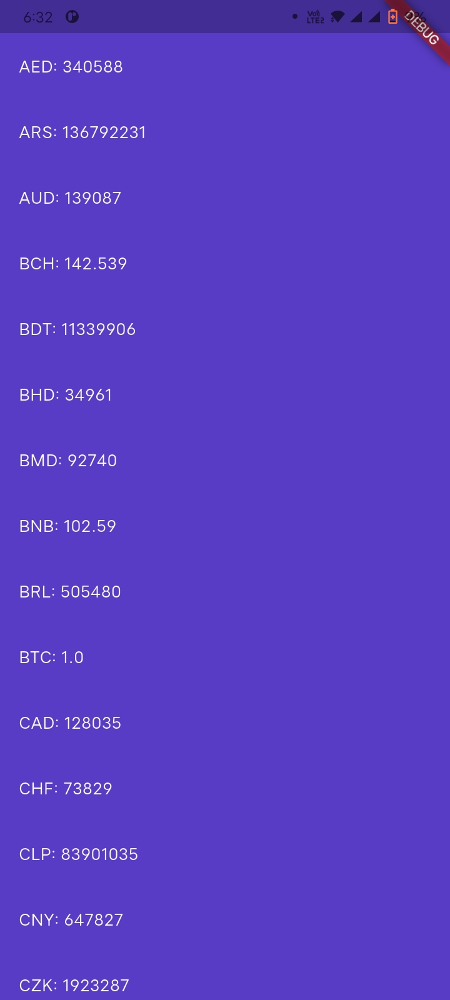

📈 CoinCap Flutter App

A Flutter cryptocurrency tracking app built using the CoinGecko API.
The app allows users to view real time crypto prices, 24h percentage changes, coin details, and exchange rates in multiple currencies.
This project demonstrates clean architecture, API integration, dependency injection using GetIt, and async UI handling with FutureBuilder.


## 📸 Screenshots

### Home Screen


### Coin Details


### Exchange Rates


## 🚀 Features

- Live cryptocurrency data from CoinGecko API
- Dropdown to switch between multiple coins
- Current USD price and 24h percentage change
- Coin image and detailed description
- Double tap to view exchange rates in multiple currencies
- Clean UI with responsive layout
- Dependency injection using GetIt
- HTTP networking using Dio


## 🛠️ Tech Stack

- Flutter
- Dart
- Dio for HTTP requests
- GetIt for dependency injection
- CoinGecko public API


## 📂 Project Structure

```text
lib/
 ├── Pages/
 │   ├── home_page.dart
 │   └── detail_page.dart
 ├── services/
 │   └── http_service.dart
 ├── models/
 │   └── app_config.dart
 └── main.dart
assets/
 └── config/
     └── main.json


## ⚙️ Setup Instructions

### Clone the repository
```bash
git clone https://github.com/Junaidchohan/CoinCap-App.git
Install dependencies
flutter pub get

Create API config file

Create the file at:

assets/config/main.json


Add the following content:

{
  "COIN_API_BASE_URL": "https://api.coingecko.com/api/v3"
}

Run the app
flutter run


## 📌 Notes

- Internet permission is required for Android
- Uses public CoinGecko API so rate limits apply
- Best viewed on Android emulator or real device

## 📜 License

This project is open source and free to use for learning purposes.


## 👤 Author

**Muhammad Junaid**  
Flutter Developer | Software Engineering Student  
Think beyond boundaries 🚀


